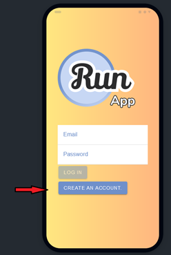
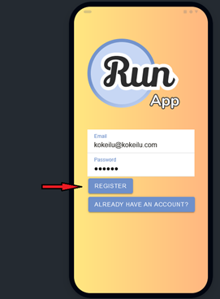
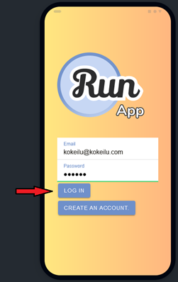
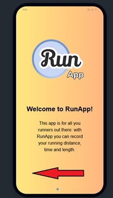
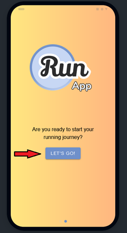
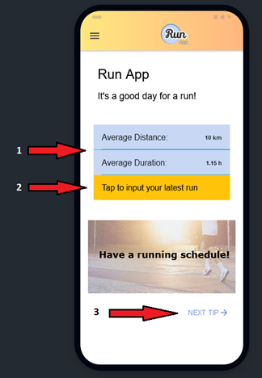
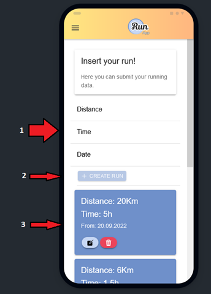
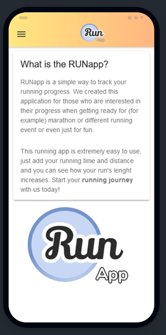
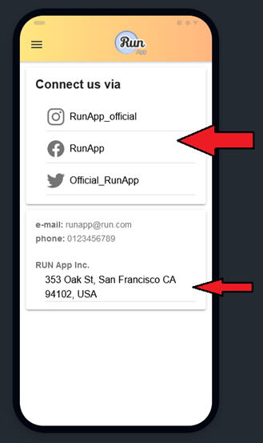
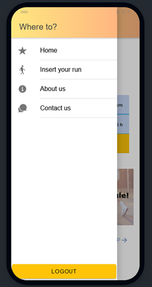

# 📜 RUNAPP STEP-BY-STEP MANUAL 📜

This is a Step-by-step user manual that teaches how to use RunApp.

 
 
   
# AUTHENTICATION 🔐

 

When opening the application there will be login or sign in options.
If you are a new user, you can register to app with your e-mail and password.

If you are an old user, you can just login.

 
 

# WELCOME SCREEN 🤗

After this, you will see a welcome text.
Red arrow shows that you need to swipe left.

By pressing the Let's go button you will be redirected to the app's home page.

 
 

# HOME PAGE 🏡

In the home page you see your average distance and durationof you runs.
Below that you can click a button that directs you to the input page where you can input your next run!
At the bottom of home page you see running tips that you can change with pressing the “next tip” button.

 
 

# INPUT PAGE ✏️

You have field in the input page where you add your latest run.
Write down your running distance, running time and running date.
After that click the “Create run” button and you will see that you run has been registered to the bottom of the page.
You can also edit your registered runs or delete them using the edit and delete buttons.

 
 

# ABOUT US PAGE ℹ️

Here you can read more about the app and see the logo in great size.
This page is basically just normal information about the app and nothing more.

 
 

# CONTACT PAGE 📧

Here you is links with icons to Instagram, Facebook and Twitter.
Below social media links you can find example e-mail address, phone number, and physical address that is also a link to Google maps.

 
 

# SIDE NAVIGATION ➡️

Here is the sidebar navigation and the icons of different pages.
Also logout button is placed at the bottom of the sidebar.

